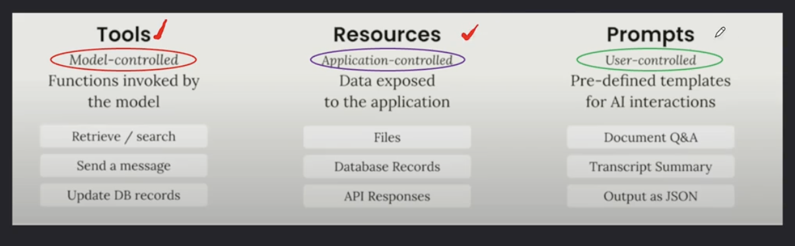
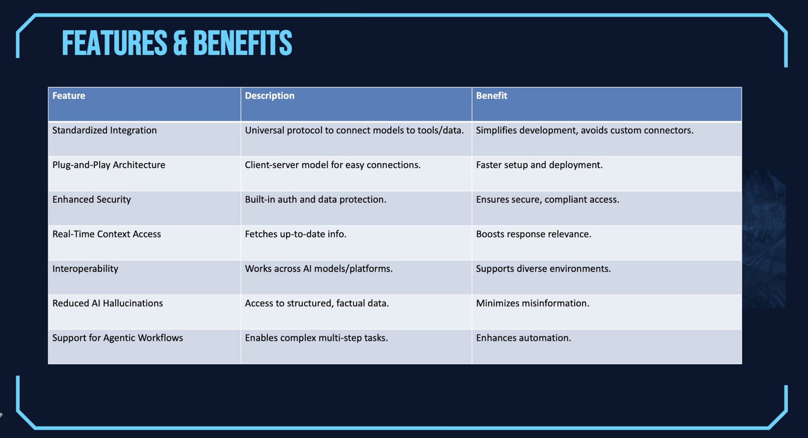
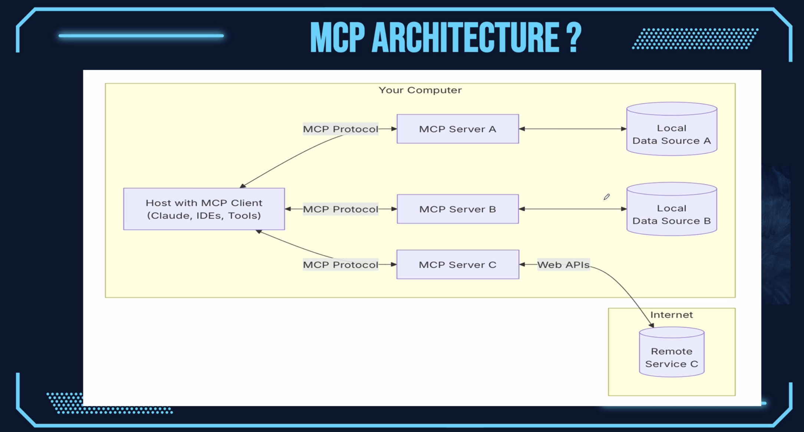
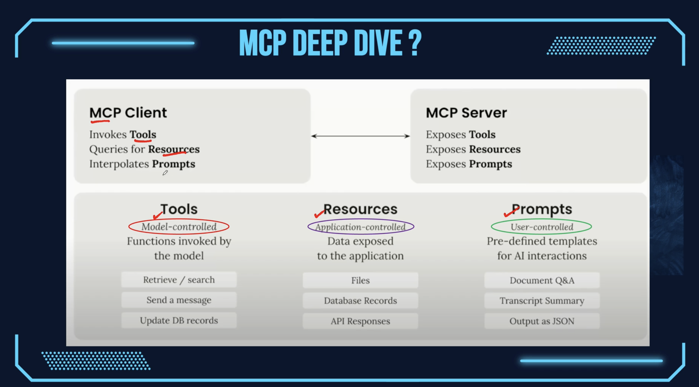
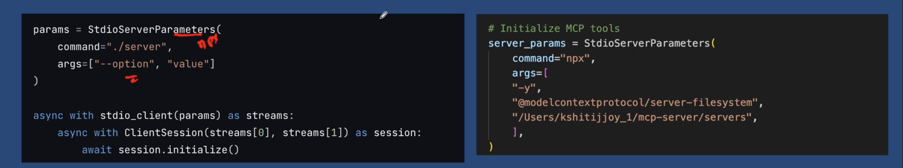
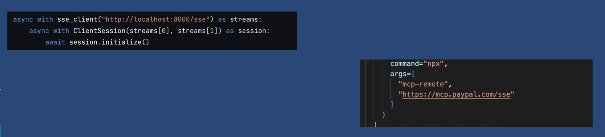

## MCP INTRODUCTION

MCP is an open protocol that standardizes how applications provide context to LLMs. Think of MCP like a USB-C port for AI applications.

MCP provides a standardized way to connect to AI models to different data sources and tools.  

Open standard by Anthropic.  

Why MCP ? : 
 - A growing list of pre-built integrations that your LLM can directly plug into 
 - The flexibility to switch between LLM providers and vendors
 - Best practices for securing your data within your infrastructure

What is a Model ?   

A model in AI is like a smart brain trained to do a specific task, such as understanding text, recognizing images or making decisions. 

It learns patterns from lots of data and then uses that knowledge to answer questions or solve problems.

LLL = a specific kind of model for understanding/generating language.


What is a Context ?    

Context means the situation, background or surrounding information that helps you understand the meaning of something. 

Contet forms part of the prompt sent to the AI model. It provides essential background information. 

MCP standardize how AI models interact with external tools and data sources by defining specific components.  

The components are : 
- Tools
- Resources 
- Prompts 

.  

What is a Protocol ?   

A protocol is a set of rules or instructions that tells different systems how to talk to each other or work together.

Open Specification 
  - Publicly Accessible, Vendor Neutral. 

Client-Server Architecture 
  - Ensures consistent implementation. 

Reduced Duplication
  - Eliminates redundant integration efforts.  

Ecosystem Development
  - Enables growth around a common standard. 




https://github.com/orgs/modelcontextprotocol/repositories 

https://github.com/modelcontextprotocol. 

## MCP ARCHITECTURE 

It consist of 3 essential building blocks. 

 - MCP Server : which host the model or actual logic.
 - MCP Client : which sends the request and handle responses.  
 - Transport Layer : which handles how the data flows between them.
  




Tools are technically functions that the MCP Client can invoke. 

What is JSON-RPC 2.0 ? 
_______

- JSON-RPC is a remote procedure call (RPC) protocol encoded in JSON.
- It's a lightweight data interchange format and designed for client-server communication.  
- It's language independent.
- Version 2.0 is the most widely used and improved version.  

Key Features of JSON-RPC 2.0
______

   - Uses JSON as the data format for both request and response.  
   - Supports requests, notifications and batch requests.  
   - Every request includes a method name, optional params and an ID
   - Reponses contain the result or an error object.

Request

```json
 {
   "jsonrpc": "2.0",
   "method" : "add",
   "params" : [2,3],
   "id" : 1
 } 
```


Response

```json
 {
   "jsonrpc": "2.0",
   "result" : "5",
   "id" : 1
 } 
```

SAMPLE 2

Request

```json
 {
   "jsonrpc": "2.0",
    "id" : 1,
   "method" : "tools/call",
   "params" : {
    "name":"weather",
    "arguments" : {
      "location" : "San Francisco"
    }
   }
 } 
```

Response

```json
 {
   "jsonrpc": "2.0",
   "id" : 1,
   "result":{
    "temperature" : 62,
    "conditions" : "Partly Cloudy"
   }
 } 
```

Overview of MCP Transport Layer
______

 - Convert Messages : Transforms MCP messages to JSON-RPC format for transmission.  
 - Enable Communication : Handles bidirectional data flow between clients and servers.
 - Standardize Interface : Provides consistence API for implementing custom transports.  
 - Ensure Flexibility : Maintains transport agnostic design for maximum adaptability. 

Transport Mechanism - STDIO
______
 The stdio transport enables communication through standard input and output streams. 

 Use stdio when: 
  - Building command-line tools e.g. cli tools 
  - Implementing local integrations e.g. integrating AI models into desktop app i.e summarization features
  - Needing simple process communication e.g. data processing, calculator app
  - Working with shell scripts e.g. task automation i.e. processes text files and create summarization on it. 



Transport Mechanism - SSE
______

This is particularly suited for scenarios where the server needs to push updates to the client. 

SSE transport enables server-to-client streaming with HTTP POST requests for client-to-server communication.  

Use SSE when : 

 - Only server-to-client streaming is needed : i.e. an AI assistant that provides real-time stock updates. So the server is constantly sending the stock price updates. So the server streams the stock price updates to the client using SSE while the client receives the stock price updates without needing to pool the server. 
 - Working with restricted networks : SSE operates over standard HTTP making it suitable for environments with strict network policy that may block non-HTTP protocol i.e. in a corporate settings. 
 - Implementing simple updates : i.e. AI powered breaking news aggregates



Transport Mechanism - Streamable HTTP
_____

Streamable HTP is the core transport mechanism in MCP since March 2025. It enables two-way connections between data sources and AI tools.

It replaces the SSE approach. It uses a single endpoint unlike the SSE that uses 2 endpoints for communication. 

 - Standardized Protocol : Provides consistent connection framework across applications. Simplifies development with unified approach. 
 - Secure Exchange : Enables protected two-way data flow. Maintains privacy while facilitating powerful integrations. 
 - Enables protected two-way data flow. Maintains privacy while facilitating powerful integrations.
 - Real-time Capabilities : Delivers streaming updates instantly. Supports dynamic AI interactions without delay.
 - Universal Compability : Works with various AI applications. Functions in chatbots, IDE assistants and more.   

  *It uses a single endpoint to handle both the HTTP Post/Get.*

 *The client sends the JSON RPC request or batch via POST indicating support for application and event stream in the accept header so if the server supports streaming or needs to send a notification request back it responds to the GET request using SSE event over that same endpoint. This means it uses same endpoint as compared to SSE*
